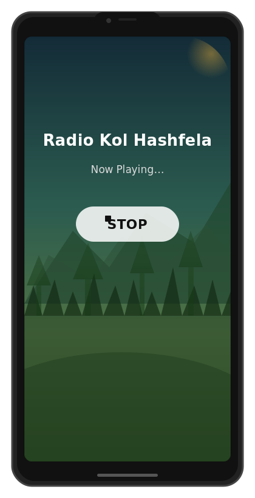

<p align="center">
  
</p>

# 📻 Radio Kol Hashfela — 103.6FM

> ⚠️ **Unofficial.** I'm just a listener who loves this station.
> Not affiliated with Radio Kol Hashfela or 103.6FM.

A **minimal, zero-permission-grabbing** Android app that streams
[Radio Kol Hashfela 103.6FM](https://radio.streamgates.net/stream/1036kh)
(רדיו קול השפלה 103.6FM) — straight from the source, with no ads,
no trackers, no nonsense.

It now includes notification-area Play/Stop controls, Shfela-region
nature backgrounds, and a quick WhatsApp button for sending the station
a pre-filled Hebrew compliment.

## What makes this different

- **No ads.** The stream plays directly — no browser, no pop-ups,
  no "skip this video" nonsense.
- **No creepy permissions.** Internet access (to play the stream)
  and notification/foreground-service access (so it can keep playing
  in the background and show Play/Stop controls).
  That's it. No camera, no mic, no contacts, no location, no
  storage, no phone state.
- **Notification controls.** Stop or restart playback from the phone's
  notification shade / top area without reopening the app.
- **Shfela scenery.** The background image is randomly chosen from
  nature photos around the Hashfela/Shfela region.
- **WhatsApp shortcut.** Tap one button to open WhatsApp to the station
  number with the message: `שיר מעולה, אתם הכי טובים!`
- **No Google Play Services.** Not even a dependency. This app
  doesn't track you, doesn't phone home, doesn't ask who you are.
- **Open source.** Every line of code is right here. Build it yourself
  in 10 seconds.

## How to get it on your phone

### Option 1 — Download the APK (easiest)

Go to the **Releases** tab on GitHub (or [click here][releases])
and grab the latest `.apk` file. Transfer it to your phone however
you like, then:

1. Open the downloaded `.apk` file on your phone
2. If prompted, allow installation from **"unknown sources"**
   (this just means you're installing outside the Play Store —
   every app store works this way)
3. Tap **Install**
4. Open the app — the radio starts playing automatically

### Option 2 — Build it yourself

You only need:
- Linux / macOS / WSL
- Android SDK (command-line tools — the build script downloads
  nothing extra beyond what the SDK needs)

```bash
# Install the Android command-line SDK, then:
git clone https://github.com/brchn6/radio-kol-hashfela.git
cd radio-kol-hashfela
./build.sh
```

The APK lands at `build/radio.apk`. Transfer it to your phone
(ADB, USB, KDE Connect, email yourself — whatever works).

## What it looks like

A random nature photo from Israel's Hashfela/Shfela area is fetched
when you open the app. The main button is **Play / Stop**, right in
the center, with a quick WhatsApp button for sending love to the station.



<small>*Mockup — the actual photo changes every time you open the app.*</small>

Background photos are loaded from Wikimedia Commons and feature places
around the Shfela such as Tel Azeka, Adullam-France Park, Britannia Park,
the Elah Valley, Beit Guvrin, and Eshtaol Forest.

## Tech details

- **API 26+** (Android 8.0+) — covers ~99% of active devices
- **AAC+ stream** at 64 kbps, served directly by the station
- **Foreground service** — keeps playing when the screen is off
  or you're using other apps
- **Media-style notification** — compact Play/Stop action in the
  notification shade
- **WhatsApp link** — opens `wa.me/972585851036` with a pre-filled
  Hebrew message
- **~20 KB APK** — smaller than most favicons
- Built with `aapt2` + `javac` + `d8` + `apksigner` — no Gradle,
  no IDE, no external libraries

## License

Do whatever you want. This is for the love of radio.

[releases]: https://github.com/brchn6/radio-kol-hashfela/releases
